<div align="center">

# bintrade_egui
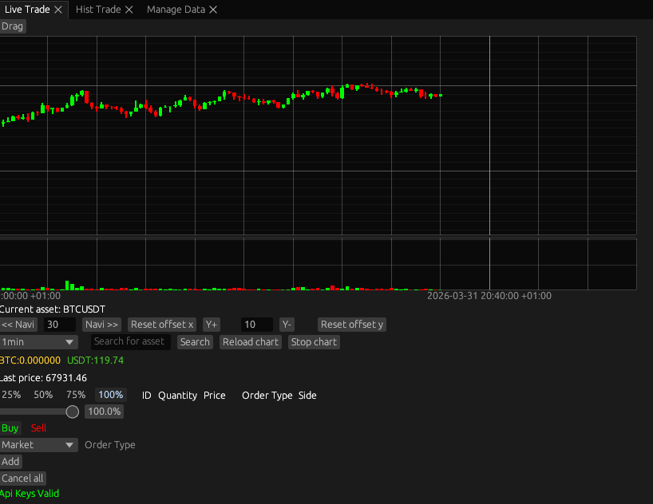
This is a simple trading app for Linux for Binance using Egui. Download historical data for an asset, do live trading through the binance API.
The goal is to make trading as fast and intuitive as using VIM :), being able to change order prices without entering prices manually, the ability to change orders using hotkeys only.. 
Orders can be added added or edited manually or can be changed using VIM bindings, see bellow for the shortcuts and use examples. 
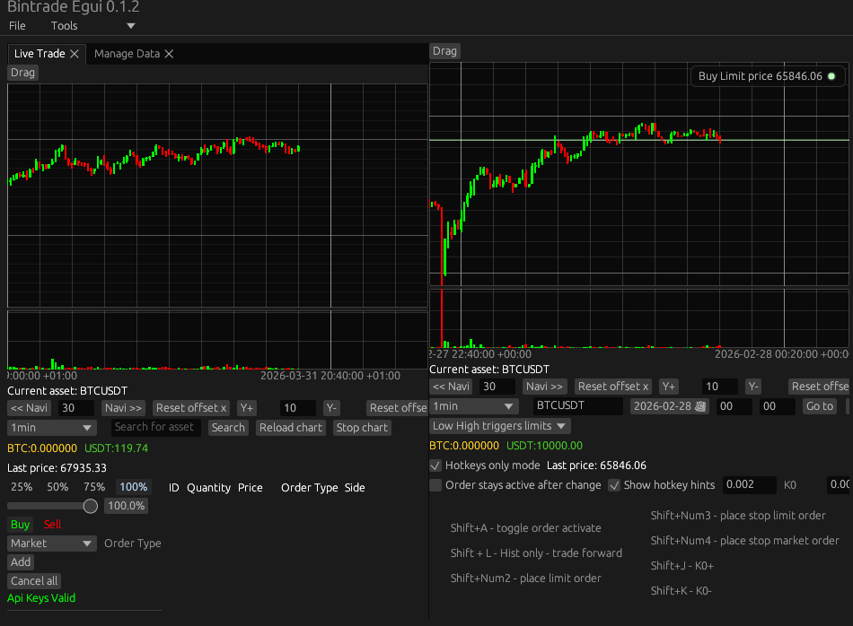
Different windows can be tiled

This is a personal project, use at your own discresion. API keys can be added, changed stored in the Settings.bin file unencrypted or encrypted with a password. If unencrypted, api keys are autoloaded, if encrypted they must be unlocked from settings with a password. Keys are stored with magic-crypt [magic_crypt](https://crates.io/crates/magic-crypt). This is a personal project, it comes with absolutelly warranty or guarantees of security on my end, nor does it contain financial advice of any kind, I am not responsible for your actions. Live price ticker is based on OrderBook price ws output. 
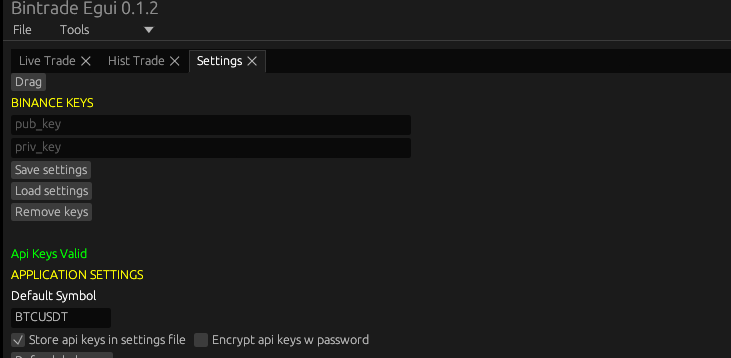
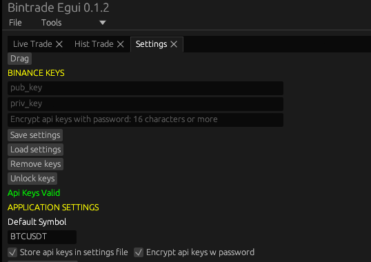

Orders can be set manually by entering prices, or via hotkeys in signle order mode, where default quantity is 100% by default
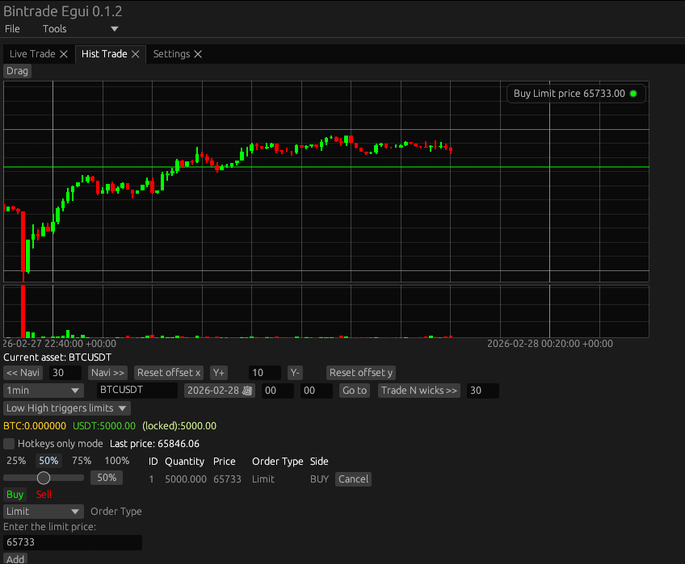
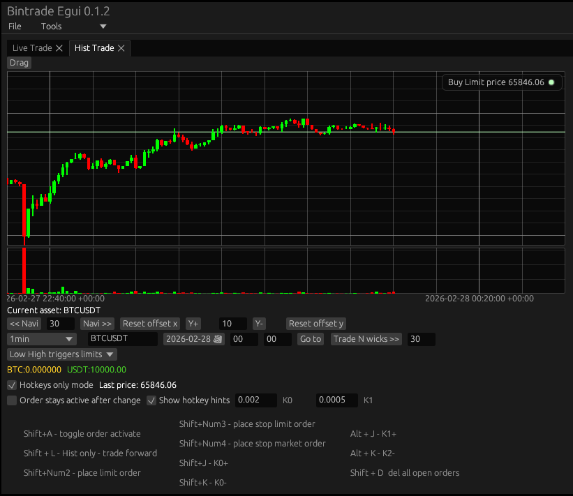


Data can be managed with the "Data manager" window. Add a symbol, download all historic data (this may be large)
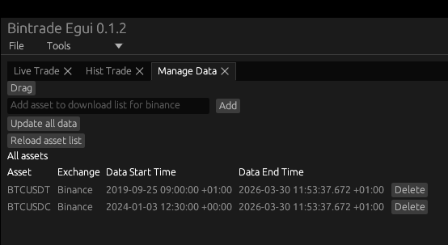


</div>

### Order Hotkeys:
```bash
Shift+A - toggle order activate
```
```bash
Shift+Num0 - place market order (If quantity is 100% based on which asset is held order side determined automatically)
```
```bash
Shift+Num1 - place limit order (By default the last price is used an order is inactive)
```
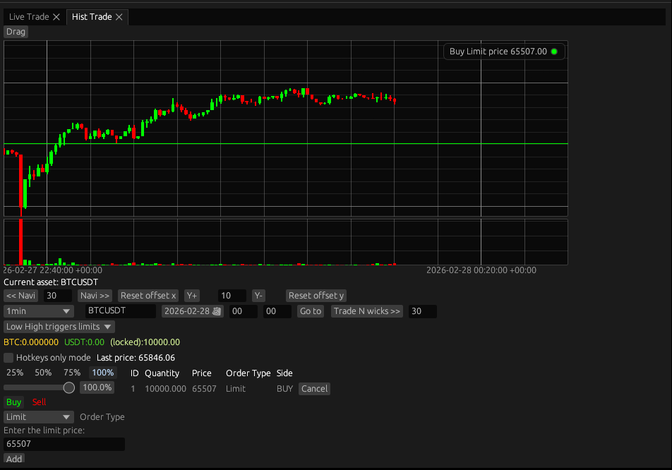
```bash
Shift+Num2 - place stop limit order 
```
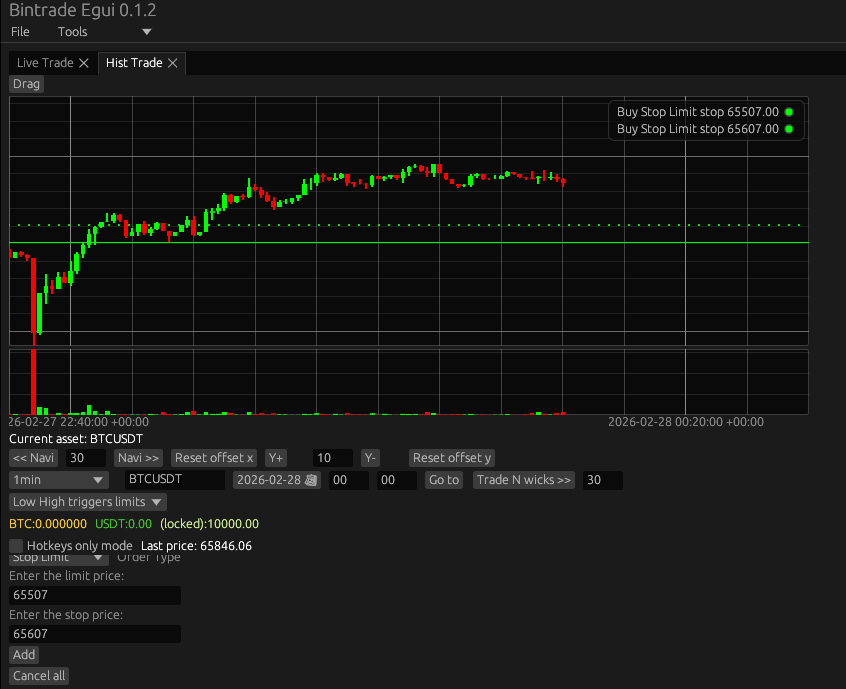
```bash
Shift+Num3 - place stop market order 
```
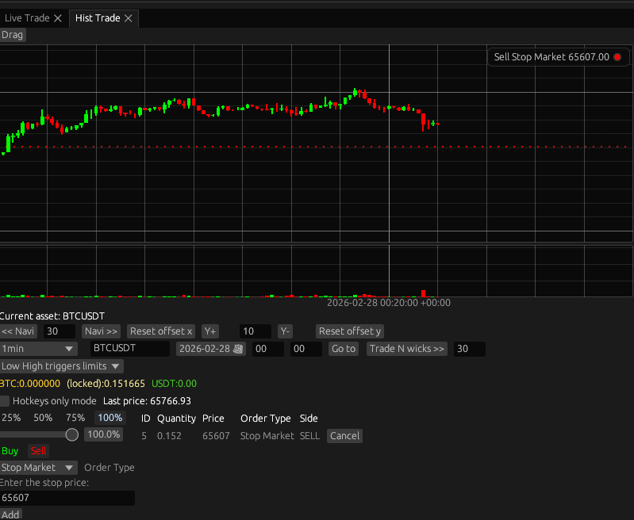
```bash

Shift+J - reduce current order price by increment (By default order is deactivated as soon as it is changed)
```
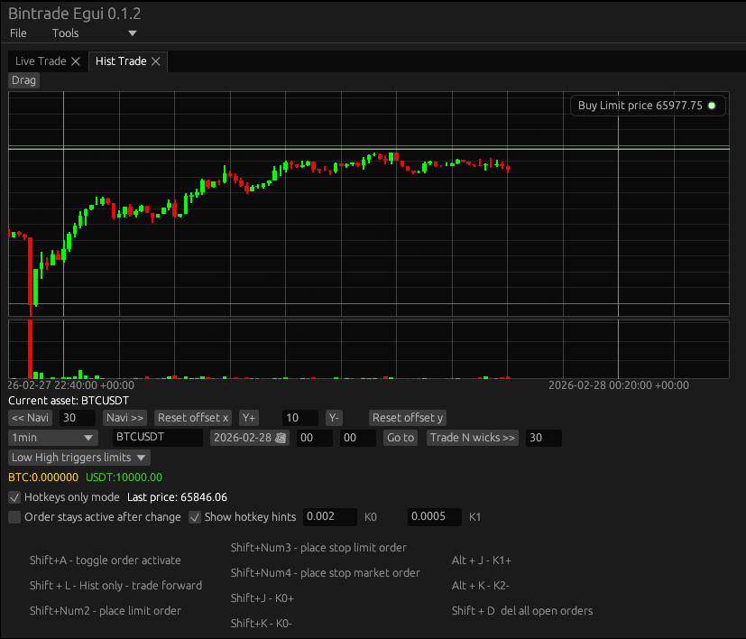
```bash
Shift+K - increase current order price by increment 
```


```bash
Alt + J - reduce 2nd key (change the percentage between limit price and stop for stop limit order)
```
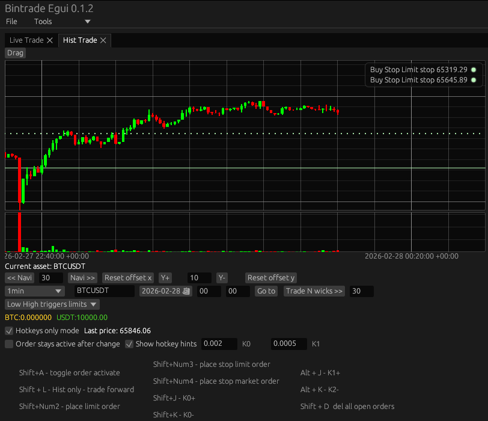
```bash
Alt + K - increase 2nd key 
```
```bash
Shift + D - delete all open orders
```
```bash
Shift + R - Cancel all open orders, place market order to sell Base asset now if held
```

### Hist trading only Hotkeys:
```bash
Shift + L - Hist only - trade forward for selected amount of hist wicks
```
```bash
Shift + H or Shift+Z - Hist only - undo last trade
```


Features:
-Live trading using Binance API
-Hist trading
-Data downloader and updated

Future features/Improvements:
-Hotkeys only mode for live trading
-Multiple live asset tickers simultaneously
-Multiple hist windows simultaneously
-Side by side asset comparison chart
-Yfinance data integration and downloader
-Hist data bookmarks
-Integrate other exchanges
-Other UI improvements

## How to use:
### Install:
```bash
cargo install bintrade-egui --bin bintrade_egui
```


I am new to Rust so PRs, suggestions, constructive criticism welcome
